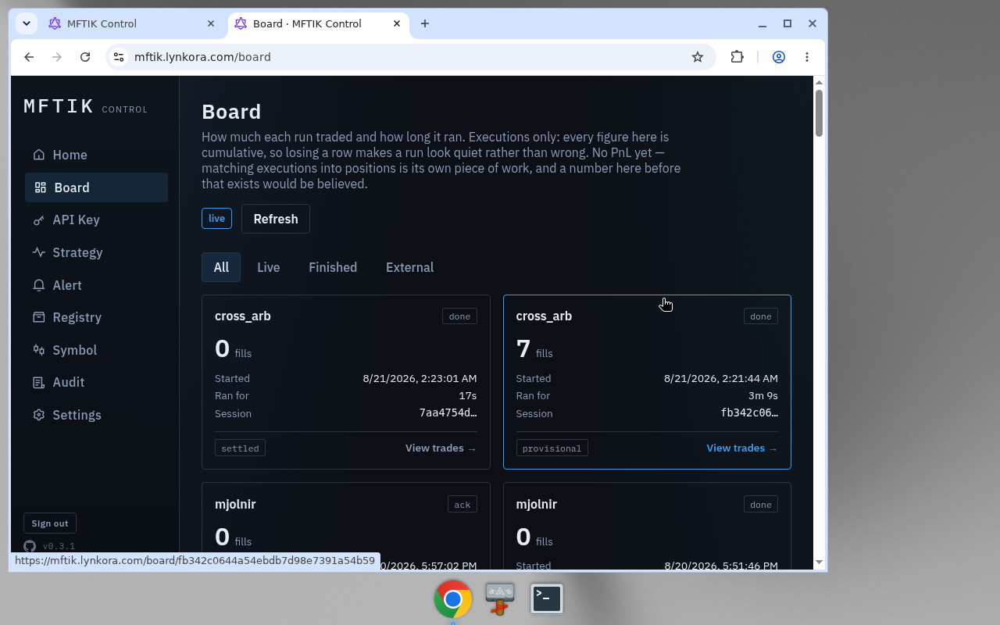
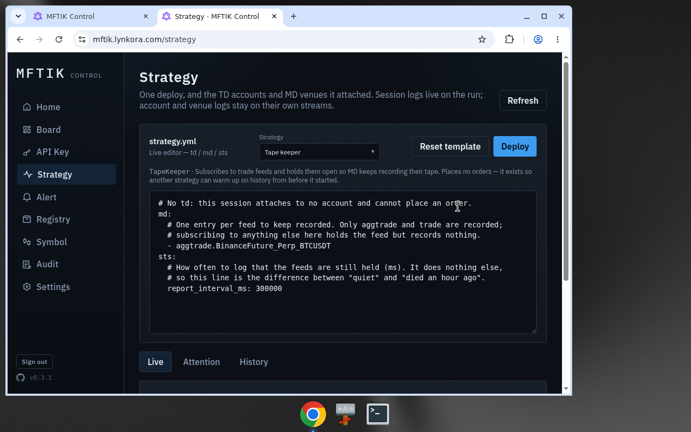

# MFTIK

A self-hosted **trading desk** you keep running. Not a backtester that prints a chart, and not a library that leaves you to invent the night shift.

You host a node. You write strategies in Python against the live book, the tape, and the accounts you attach. The node keeps the processes up, records what happened, and gives an operator a place to live with the runs — deploy, watch, stop, ack a failure, pull the log.

```
pip install mftik
mftik node-init ./mynode
```

## Who it is for

Traders who invent the signal, not only those who wait for a candle to close.

Most platforms start at `on_kline` and stay there. MFTIK treats klines as one feed among several. A strategy can sit on the touch, read every print, warm up on tape that was recorded before it started, watch liquidations on a perp, or query a book once because that is all the question needed.

The bundled examples are that kind of work: a chase that reclines a post-only order into the spread, a cross-venue quote-and-hedge, MACD on **dollar bars** built from the tape, an OCO that asks for one quote and then waits. If your edge is "when the 1h closes above the MA", you can still write that. The point is you are not required to.

It is also for the person who has to keep that work alive. A desk is sessions, credentials, peers, and a trail of who did what. Those are first-class here, not an exercise left to the reader.

## Control

The operator lives in the browser: sessions on the Board, deploys from Strategy. This is the desk, not a chart from a backtest.





## What a node is

One machine (or one compose project) that owns:

| Plane | Job |
|---|---|
| **STS** | Runs your strategy. One instance per session. Hooks, timers, OMS, ledger, tape. |
| **TD** | Talks to venues. Places and cancels. Owns the book of orders and the balances. Fences an attach with a lease — only the session that holds it may trade. |
| **MD** | Talks to public feeds. Fans them out to sessions. Records the tape so a later strategy can warm up on prints it was not running for. |
| **SYM** | The symbol plane. Tick, step, min notional — independent of any session, so you can round an order before anything is live. |
| **Paper** | A simulated venue in the same stack. Same ticker shape, same OMS path, no real money. |
| **API + UI** | The control plane. Browser for the operator, `mftik` CLI for the laptop that writes code. |

Domains do not import each other. They talk through Redis. A market-data restart is not supposed to take order entry with it; a strategy crash is not supposed to drop the venue connection. That split is the product, not an implementation detail.

The node is **single-tenant**. One Owner. That person may prove who they are with a password, Discord, or Google, and mint machine keys for scripts and for other nodes. Nobody else gets a user row.

## A strategy is not a candle loop

Subclass `Strategy`, override the hooks you care about, trade through the accessors the base class binds.

```python
from mftik.strategy import Strategy


class MyStrategy(Strategy):
    name = "my_strategy"

    async def on_best_quote(self, quote) -> None:
        await self.log(f"{quote.universal_ticker} {quote.bid}/{quote.ask}")
        # self.oms places and cancels
        # self.ledger reads balances (and leverage on perps)
        # self.tape warms up on prints from before this session
        # self.mds queries history the feeds do not carry
        # self.symbols gives tick / step / min notional
        # self.timer schedules work
```

**Live feeds** — you subscribe in the deploy document (`md:`), one topic per instrument:

| Hook | Topic | What it is |
|---|---|---|
| `on_best_quote` | `bestquote` | Touch with sizes, at book speed |
| `on_order_book` | `orderbook` | Full snapshot each time (no depth-diff sequencing) |
| `on_trade` | `trade` | One match, taker side |
| `on_agg_trade` | `aggtrade` | Same flow, venue-aggregated — cheaper, and `match_count` is in the print |
| `on_kline` | `kline_{interval}` | In-progress candle re-pushed; only `closed` is final |
| `on_ticker` | `ticker` | 24h stats + top of book |
| `on_liquidation` | `liquidation` | Other accounts being closed out — not your fill |

A subscribe the venue does not serve is **refused at attach**, not silently empty. Gate has no aggregated tape; paper has no candles; Bybit liquidations are a perp feed. See the [matrix](#exchange-integration) below.

**Queries** are the other half. `self.mds.fetch_klines` / `fetch_order_book` / `fetch_best_quote` ask once and answer once. Needing the book at one moment is a query. Living on every change is a subscription. An OCO in this tree does the first; a chase does the second.

**The tape.** MD records `trade` / `aggtrade` while somebody holds the feed. `self.tape.read(...)` hands a later session the same `Trade` / `AggTrade` objects the live hooks get, plus coverage — `continuous_since_ms`, measured gaps, whether recording is still on. A count of prints is not a length of history; the slice says what it covers. `TapeKeeper` is a bundled strategy that subscribes and does nothing else, so the tape exists before the strategy that will need it is deployed.

**Private events** arrive from the account, not from a candle: order updates, fills, rejects, balances, positions (contracts only). `td.{api_id}.global` is account-wide — filter with `self.owns(cid)` before you treat a fill as yours.

Instruments are **universal tickers**: `Venue_Category_SYMBOL`. `Gate_Spot_BTCUSDT`, `BinanceFuture_Perp_BTCUSDT`, `Bybit_Spot_ETHUSDT`. The middle part is the book, not a nickname.

## Exchange integration

A venue here is **one connection with one credential**. Binance spot and Binance USD-M are two venues — different hosts, different wallets, different keys. Bybit's unified account is one venue with two categories behind the same key.

| Venue | Markets | Credential | Trade | ticker | trade | book | quote | kline | aggtrade | liq |
|---|---|---|---|---|---|---|---|---|---|---|
| **Paper** | Spot (sim) | any | yes | yes | yes | yes | — | — | — | — |
| **Gate** | Spot | HMAC | yes | yes | yes | yes | yes | yes | — | — |
| **GateFutures** | USD-M perp | HMAC | yes | yes | yes | yes | yes | yes | — | yes |
| **Binance** | Spot | Ed25519 | yes | yes | yes | yes | yes | yes | yes | — |
| **BinanceFuture** | USD-M perp | Ed25519 | yes | yes | yes | yes | yes | yes | yes | yes |
| **Bybit** | Spot + perp | HMAC | yes | yes | yes | yes | yes | yes | — | perp |

`yes` means the adapter serves it. `—` means a subscribe (or a query of that kind) is refused, not faked.

History reads — `fetch_klines`, `fetch_order_book`, `fetch_best_quote` — are on both Gate planes, both Binance planes, and Bybit. They do not require a live feed. Paper answers ticker and book only.

Binance's WebSocket API accepts **Ed25519** keys for `session.logon`. An HMAC key can still hit Binance REST; this adapter does not use REST for trading, so an HMAC credential is refused when you store it rather than failing the first order.

A missing feed is a property of the venue, not a bug in the strategy. `aggtrade` on Gate and `liquidation` on spot are the two people usually meet first.

## Quick start

You need Docker, and Python 3.12+ on the machine you write strategies on.

### 1. Host a node

```bash
pip install mftik
mftik node-init ./mynode
cd mynode
docker compose pull
docker compose up -d
```

`node-init` writes compose, a Caddyfile, and a `.env` (mode `0600`, with a generated database password). Postgres, Redis, and the edge are part of the stack — you do not have to bring them. The images come from GHCR. Pin `MFTIK_VERSION` in `.env` once the node matters; `:latest` moves under you.

`up` waits for `migrate` (`alembic upgrade head`, idempotent) and `seed` (Owner row + two paper accounts, also idempotent) before the planes start. A later `pull` + `up` applies new revisions the same way.

Open the URL Caddy is bound to (default `http://localhost:8080`). First visit claims the instance — that is the Owner, and it is not undoable from this side.

### 2. Point this machine at it

```bash
mftik connect http://localhost:8080 --setup
mftik whoami
```

`connect` signs in, mints an API key, stores the key, and drops the session. The password is never written down. Profiles live in `~/.config/mftik/config.toml` at `0600`. For CI, pass an existing key with `--token`.

### 3. Write something and run it

```bash
mftik init ./hello          # fills account + feed from the node you just claimed
mftik check ./hello         # import gate + on_initialized, offline
mftik run ./hello           # push, deploy, tail the session log
```

`init` asks the node which accounts and instruments it has, and writes a strategy that reads the book and exits after a few snapshots. `run` copies the tree into the node's **private** registry, deploys it, and tails. Ctrl-C drops the tail and does **not** stop the session — `mftik stop <session>` does, or the STS page.

```bash
mftik ps
mftik logs -f <session>
mftik stop <session>
```

A strategy may import the standard library, `mftik`, files in its own tree, and third-party names it **declares** and the node has applied (`mftik env add numpy`, then `requires = ["numpy"]` on the class). `mftik check` tells you before you push. A name you did not declare is refused even if it is already on the node's `sys.path`.

### This repository (development)

The layout-and-commands README that used to live here is at [`docs/archive/README.md`](docs/archive/README.md). From a checkout:

```bash
cp .env.example .env
just sync            # uv workspace + frontend npm install
just install-hooks   # pre-commit: fail early on a stale OpenAPI contract
just up              # build the shared image once, then compose up
```

- API: http://localhost:8000/health
- UI: http://localhost:5173

Use `just up` rather than `docker compose up --build`. Every Python service shares one image tag; building them all at once races.

```bash
just test              # pytest (sqlite)
just lint              # ruff
just migrate           # alembic upgrade head
just seed              # Owner row + two paper APIs
just openapi           # regenerate contracts/openapi.json
just check-contracts
just frontend-check
```

Apps do not import each other. Shared code is `packages/common` (`import mftik`) and `packages/db` (`import mftik_db`).

## The desk, 24/7

A framework gives you `on_bar` and a backtest report. A desk has to answer what happens at 3 a.m. when a process dies, a deploy restarts MD, or a CI key ships a tree that cannot import.

**Planes stay up independently.** STS, TD, MD, SYM, and paper are separate processes on one broker. The UI is a status board across them, not a script you re-run.

**Sessions are the unit of work.** Deploy from the STS page or `mftik run`. Live / Attention / History — the rows you must stop or ack are not buried under last month's `done`. A failed session keeps its reason until an operator acks it.

**Leases fence the dangerous verbs.** Only the process that holds the attach may place an order. Heartbeats expire; a ghost session does not keep trading.

**The tape survives a restart.** Redis is long-lived. A recorder that shut down cleanly leaves a *measured* hole; a reader is told about it instead of treating two hours of intact prints as gone. Closing the remaining seconds-wide deploy gap is a handover, not an emergency.

**Rebuild on boot.** `STS_REBUILD_ON_BOOT` brings interrupted sessions back after the stack returns. Facts the strategy `remember`ed come back through `on_rebuild` before `on_start`; resting orders come from recon, not from anything stored. A strategy that leaves orders at the venue must know it was away (`rebuildable`); the process default is off because a restored instance that treats recon as a clean account will place alongside what it left.

**An event log per session.** Every hook the strategy was offered, and every order, cancel, and query it sent — written whether or not the strategy handled the event. Separate from `self.log`, which is what you meant and what the UI tails.

**Paper is in the same desk.** Seed creates paper accounts. The ticker is `Paper_Spot_…`. The path from a laptop to a fill is the same path a Gate order will take.

**A registry, not a shared disk.** Push your own trees. Publish what another node may pull. A peer connects with a **registry** key, which can only read the peer-facing routes — it cannot mint keys or deploy. Connecting compares the extras each node has applied; a missing `numpy` is a refused connect, not a surprise `ImportError` after the copy.

**Audit is the proof, not the user id.** One Owner. The interesting column is whether it was the password, Discord, Google, or which API key. A CI deploy and a click in the UI must not look the same.

## License

MIT. The published `mftik` package and this repository share that license.
